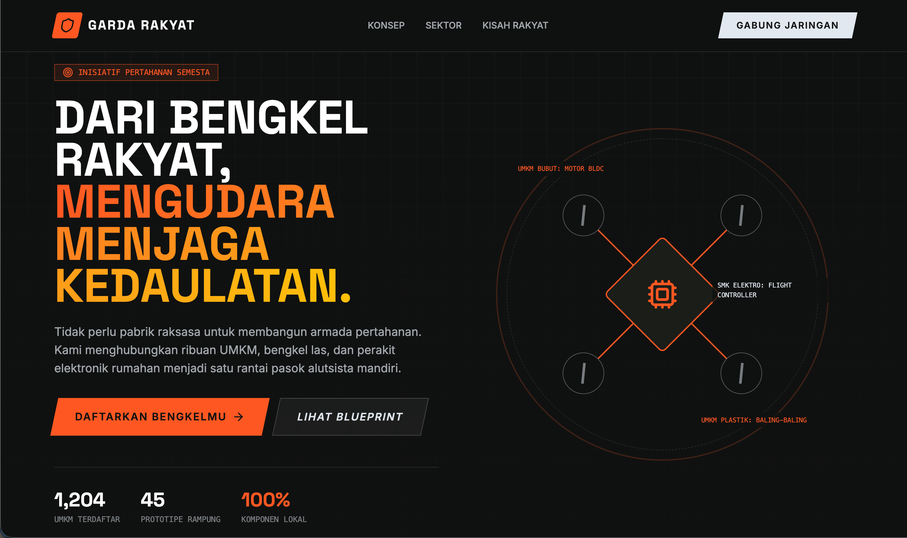

# Garda Rakyat



Landing page untuk inisiatif jaringan UMKM pertahanan nasional menghubungkan bengkel las, perakit elektronik, pabrik kecil, dan SMK di seluruh Indonesia menjadi satu rantai pasok (supply chain) terdesentralisasi untuk produksi komponen drone dan rudal.

## Konsep

Garda Rakyat mengangkat ide bahwa pertahanan negara tidak harus bergantung pada satu pabrik raksasa. Ribuan UMKM bisa saling melengkapi untuk memproduksi komponen alutsista secara mandiri mulai dari rangka, motor, sensor, hingga sistem kendali lalu dirakit menjadi unit utuh di sel-sel perakitan tersebar.

Tema visual yang digunakan adalah militeristik-merakyat: palet warna gelap khas militer (#0f1110, #1a1d1a) dikombinasikan dengan aksen oranye (#ff5722) yang mencolok. Elemen desain menggunakan pola grid dan blueprint, tipografi stensil, serta bentuk-bentuk skew yang tegas.

## Tech Stack

| Layer     | Teknologi                                               |
| --------- | ------------------------------------------------------- |
| Framework | React 19 + TypeScript                                   |
| Build     | Vite 6                                                  |
| Styling   | Tailwind CSS 4 (via `@tailwindcss/vite`)                |
| Animasi   | Motion (framer-motion) untuk scroll/entry animation     |
| Ikon      | Lucide React                                            |
| Font      | Space Grotesk (heading) + Inter (body) via Google Fonts |

## Struktur Proyek

```
gardarakyat/
  index.html            // Entry point HTML
  vite.config.ts        // Konfigurasi Vite (plugin React, Tailwind, alias)
  tsconfig.json         // Konfigurasi TypeScript
  package.json          // Dependencies dan scripts
  metadata.json         // Metadata proyek (nama, deskripsi)
  src/
    main.tsx            // Bootstrap React (createRoot)
    App.tsx             // Seluruh komponen landing page
    index.css           // Custom theme Tailwind, font import, pattern CSS
```

## Komponen

Seluruh komponen didefinisikan dalam satu file `src/App.tsx`:

- **Navbar** : Navigasi fixed dengan logo, menu anchor (Konsep, Sektor, Kisah Rakyat), dan tombol CTA "Gabung Jaringan".
- **HeroAssembly** : Visualisasi interaktif perakitan drone: empat propeler terbang masuk ke posisi (spring animation), garis koneksi bertahap muncul ke unit pusat (CPU), lengkap dengan label UMKM kontributor.
- **Hero** : Section pembuka full-screen dengan tagline "Dari Bengkel Rakyat, Mengudara Menjaga Kedaulatan", statistik (UMKM terdaftar, prototipe rampung, komponen lokal), dan dua tombol CTA.
- **Concept** : Tiga kartu konsep utama: Standarisasi Presisi, Sistem Perakitan Sel, dan Kedaulatan Ekonomi. Masing-masing menggunakan scroll-triggered animation.
- **Sectors** : Empat sektor produksi: Rangka & Aerodinamika, Propulsi & Motor, Avionik & Sensor, Hulu Ledak. Setiap kartu menampilkan target UMKM yang cocok dan daftar komponen.
- **Stories** : Testimoni fiktif "Pak Budi" dari Bengkel Las Maju Jaya, Sleman, dengan gambar placeholder (picsum.photos) dan overlay bergaya militer.
- **CTA** : Section penutup dengan latar blueprint pattern dan tombol besar "Mulai Produksi Sekarang".
- **Footer** : Navigasi sekunder, kontak (PGP, Signal, Email), dan copyright.

## Menjalankan Lokal

```bash
# Install dependencies
bun install

# Jalankan dev server (port 3000)
bun run dev

# Build produksi
bun run build

# Preview hasil build
bun run preview

# Type check
bun run lint
```

## Custom Theme

Theme Tailwind didefinisikan di `src/index.css` menggunakan directive `@theme`:

- **Warna**: `military-900` (#0f1110), `military-800` (#1a1d1a), `military-700` (#262b26), `accent-orange` (#ff5722), `accent-yellow` (#ffc107), `paper` (#e2e8f0)
- **Font**: `font-sans` (Inter), `font-display` (Space Grotesk)
- **Pattern CSS**: `.grid-pattern` (garis grid tipis putih), `.blueprint-pattern` (garis grid oranye berlapis), `.stencil-text` (uppercase, letter-spacing lebar)

## Catatan

- Gambar menggunakan placeholder dari picsum.photos. Untuk produksi, ganti dengan aset foto/ilustrasi asli.
- Tombol-tombol CTA saat ini belum terhubung ke backend atau halaman lain.
- Proyek ini di-generate melalui Google AI Studio sebagai proof-of-concept landing page.

## Lisensi

Hak cipta 2026 Garda Rakyat.
